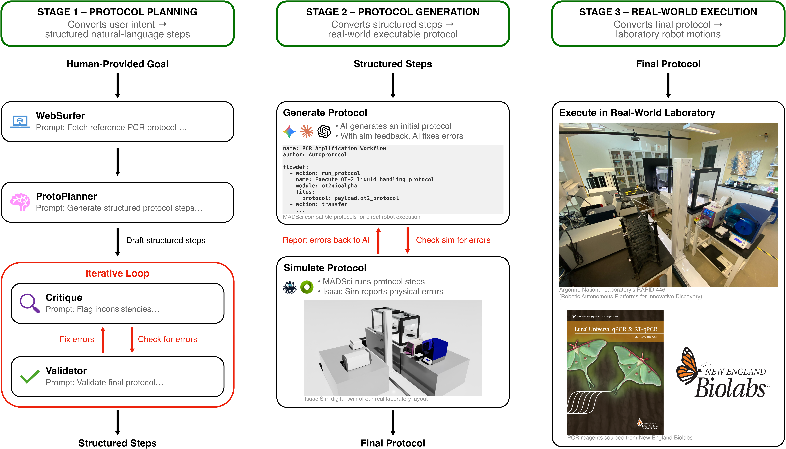

# PRISM: Protocol Refinement through Intelligent Simulation Modeling

PRISM is a research framework for **automated experimental protocol generation, validation, and execution** in robotic laboratories. It integrates language-model–based reasoning, simulation-driven validation, and robot-aware execution to enable end-to-end automation without human intervention between experimental steps.

This repository accompanies the PRISM paper and provides the **prompts and code** used for protocol planning, protocol generation, simulation-based validation, and robotic execution.

---

## Overview



**Figure:** *Overview of the PRISM framework for protocol generation and execution.  
The system consists of three main stages: Protocol Planning, where user intent is converted into structured steps; Protocol Generation, where structured English instructions are transformed into robot-aware actions and iteratively refined through validation cycles in Omniverse before execution; and Real-World Execution, where the full pipeline is validated using the Luna qPCR protocol in our autonomous laboratory.*

---

## PRISM Workflow

PRISM operates as a closed-loop system with three core stages:

### 1. Protocol Planning
User intent is converted into **structured natural-language experimental steps** using language-model–based reasoning.  
This stage may involve:
- Automatically retrieving reference procedures from web-based sources
- Generating structured experimental steps (e.g., liquid handling, timing, dependencies)
- Identifying required reagents, instruments, and constraints

---

### 2. Protocol Generation & Validation
Structured protocol descriptions are transformed into **robot-aware, executable protocols**.  
This stage includes:
- Translation into the Argonne **MADSci protocol format**
- Coordination across multiple robotic instruments
- Simulation-based validation in a **digital twin** environment built in NVIDIA Omniverse
- Iterative refinement cycles where detected physical or sequencing errors are reported back and corrected

Protocols must pass simulation-based validation before execution.

---

### 3. Real-World Execution
Validated protocols are executed on an autonomous laboratory platform composed of off-the-shelf robotic instruments, including:
- Opentrons OT-2 liquid handler
- PF400 robotic arm
- Azenta plate sealer and peeler

The full pipeline is demonstrated using **Luna qPCR amplification**.

---

## Benchmarking & Evaluation

PRISM supports systematic benchmarking across:
- Single-agent vs multi-agent protocol generation
- Constrained vs open-ended prompting paradigms
- Protocol correctness, ordering, and refinement efficiency

Simulation-based validation enables consistent detection of physical infeasibility prior to real-world execution.

---

## Repository Structure

```
PRISM/
├── run_prism.py                  # End-to-end pipeline (Stage 1 → Stage 2)
├── ProtocolPlanner/              # Stage 1: Protocol Planning
│   ├── run_stage1.py             # Multi-agent / single-agent LLM pipeline
│   ├── requirements.txt          # Python dependencies (openai, anthropic, google-generativeai)
│   └── Prompts/                  # Prompt templates per experiment and paradigm
│       ├── PCR/                  #   PCR: constrained, open-ended, single-agent variants
│       └── CellPainting/         #   Cell Painting: multi-agent and single-agent
├── ProtocolGenerator/Code/       # Stage 2: Protocol Generation + Simulation Validation
│   ├── run_agent.sh              # Launches Claude Code for autonomous protocol generation
│   ├── projects/prism/           # PCR project: prompts, workflow configs, simulation launcher
│   ├── slcore/                   # Simulation core (robot servers, REST gateway, motion)
│   └── assets/                   # 3D robot models and labware (USD format)
└── outputs/                      # End-to-end pipeline outputs (auto-generated)
```

---

## Prerequisites

**Stage 1 (Protocol Planning):**
- Python 3.10+
- API key(s) in `ProtocolPlanner/.env`: `OPENAI_API_KEY`, `ANTHROPIC_API_KEY`, and/or `GOOGLE_API_KEY`

```bash
pip install -r ProtocolPlanner/requirements.txt
```

**Stage 2 (Protocol Generation + Simulation):**
- Linux with NVIDIA GPU (Isaac Sim 5.1)
- Docker and Docker Compose (for MADSci services)
- Claude Code CLI (`claude`)
- See `ProtocolGenerator/Code/README.md` for full setup

---

## Quick Start

### End-to-end pipeline

```bash
# Full pipeline: Stage 1 (LLM planning) → Stage 2 (code generation + simulation)
python run_prism.py --experiment pcr --paradigm constrained --model gpt-5

# With Claude Opus, open-ended paradigm
python run_prism.py --experiment pcr --paradigm open-ended --model claude-opus
```

### Stage 1 only (no GPU required)

```bash
# Run protocol planning, skip simulation
python run_prism.py --experiment pcr --paradigm constrained --model claude-opus --stage1-only

# Or call Stage 1 directly
python ProtocolPlanner/run_stage1.py --experiment pcr --paradigm constrained --model gpt-5

# List all available configurations
python ProtocolPlanner/run_stage1.py --list
```

### Stage 2 only (reuse existing Stage 1 output)

```bash
# Point Stage 2 at a previously generated protocol
python run_prism.py --experiment pcr \
    --stage2-only ProtocolPlanner/outputs/pcr_constrained_gpt-5_20260323_120000/final_protocol.txt
```

### Supported models

| Name | Provider | Model ID |
|------|----------|----------|
| `gpt-5` | OpenAI | gpt-5 |
| `gpt-4o` | OpenAI | gpt-4o |
| `claude-opus` | Anthropic | claude-opus-4-6 |
| `claude-sonnet` | Anthropic | claude-sonnet-4-6 |
| `gemini-pro` | Google | gemini-2.5-pro |
| `gemini-flash` | Google | gemini-2.5-flash |
| `gemini-flash-lite` | Google | gemini-2.5-flash-lite |

---

## Benchmarking & Evaluation

PRISM supports systematic benchmarking across:
- Single-agent vs multi-agent protocol generation
- Constrained vs open-ended prompting paradigms
- Protocol correctness, ordering, and refinement efficiency

Simulation-based validation enables consistent detection of physical infeasibility prior to real-world execution.

---

## Scope & Disclaimer

This repository is intended for **research and benchmarking purposes**.
Protocols generated by PRISM should be independently reviewed and validated before use in safety-critical or production laboratory environments.

---

## Citation

If you use PRISM or build upon this work, please cite:

```bibtex
@article{hsu2026prism,
  title   = {PRISM: Protocol Refinement through Intelligent Simulation Modeling},
  author  = {Hsu, Brian and Setty, Priyanka V. and Butler, Rory M. and
             Lewis, Ryan and Stone, Casey and Weinberg, Rebecca and
             Brettin, Thomas and Stevens, Rick and Foster, Ian and
             Ramanathan, Arvind},
  journal = {Digital Discovery},
  year    = {2026},
  publisher = {Royal Society of Chemistry},
  doi     = {10.1039/XXXXXXXXX}
}
```
